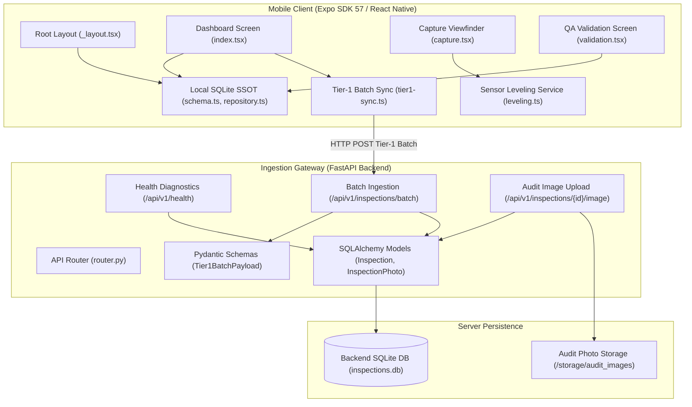
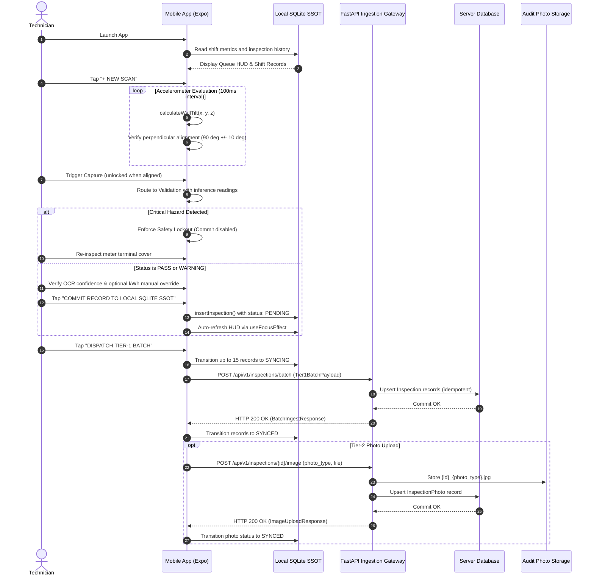

# Novo

Offline-first smart meter inspection and edge quality assurance platform. The system comprises an Expo mobile field application with local SQLite persistence and a FastAPI ingestion gateway for cellular telemetry batching and audit photo storage.

## Architecture



## Data Flow



## System Components

### Mobile Client (`src/`)
- **Local SQLite SSOT** (`src/core/db/`): Configured with WAL journal mode (`PRAGMA journal_mode = WAL`) and crash recovery resetting uncommitted `SYNCING` records back to `PENDING` on startup.
- **Sensor Leveling** (`src/services/sensor/leveling.ts`): Uses accelerometer vector magnitudes to compute tilt from vertical, enforcing perpendicular alignment within 10 degrees before capture unlocks.
- **Tier-1 Batch Sync** (`src/services/sync/tier1-sync.ts`): Dispatches offline inspection telemetry batches (up to 15 records per payload) to the gateway endpoint.
- **Safety Lockout Enforcement** (`src/app/validation.tsx`): Blocks submission when critical hazards are detected, requiring field remediation.
- **Shift Dashboard** (`src/app/index.tsx`): Displays real-time offline queue metrics HUD, meter search, and automated focus re-querying via `useFocusEffect`.

### Ingestion Gateway (`backend/`)
- **FastAPI Application** (`backend/app/main.py`): Asynchronous gateway with CORS middleware, lifespan database bootstrapping, and structured API routing under `/api/v1`.
- **Telemetry Batch Ingestion** (`backend/app/api/v1/inspections.py`): Endpoint `/api/v1/inspections/batch` accepting `Tier1BatchPayload` with idempotent upsert logic.
- **Audit Image Upload** (`backend/app/api/v1/inspections.py`): Endpoint `/api/v1/inspections/{inspection_id}/image` accepting multipart form data for photo types (`CASING`, `TERMINAL_COVER`, `DISPLAY`, `TAMPER_SEAL`) persisted to `storage/audit_images/`.
- **Database Layer** (`backend/app/core/database.py`, `backend/app/models/inspection.py`): SQLAlchemy models with cascading foreign keys and unique constraints per photo type.
- **Diagnostics** (`backend/app/api/v1/health.py`): Endpoint `/api/v1/health` providing database connectivity checks with HTTP 503 degraded error responses on connection loss.

## Getting Started

### Prerequisites
- Node.js (v18+) and pnpm
- Python (3.14+) and uv (or pip)

### Mobile Application

```bash
# Install dependencies
pnpm install

# Start Metro bundler
pnpm start

# Target platforms
pnpm android
pnpm ios
pnpm web

# Code quality
pnpm lint
pnpm check
npx tsc --noEmit
```

### Ingestion Gateway

```bash
cd backend

# Create virtual environment and install dependencies
uv venv
uv pip install -r requirements.txt

# Run development server
uvicorn app.main:app --reload --host 0.0.0.0 --port 8000

# Run test suite
pytest tests

# Linting
ruff check app tests
```
