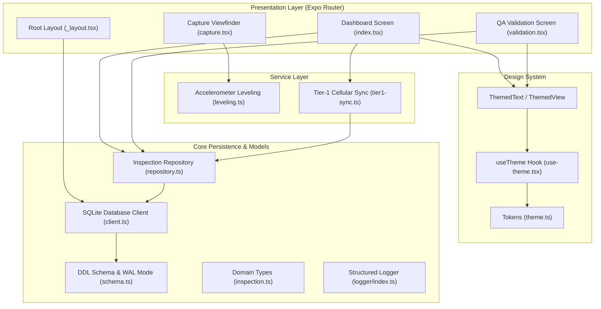
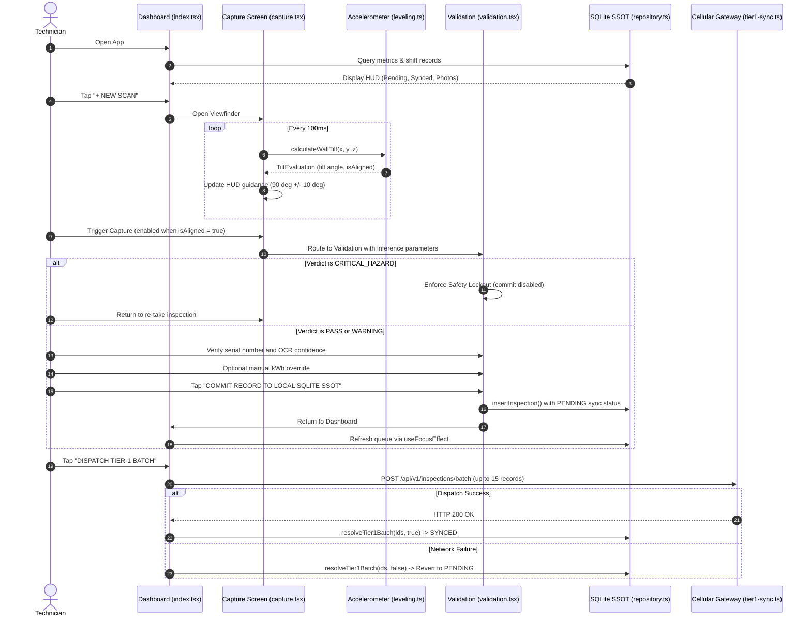

# Novo

Offline-first smart meter inspection and edge quality assurance application for field technicians, built with Expo SDK 57, React Native, and local SQLite persistence.

## Architecture



## Data Flow



## Core Modules

- **Local SQLite SSOT** (`src/core/db/`): Configured with WAL journal mode (`PRAGMA journal_mode = WAL`) and crash recovery that resets dangling `SYNCING` records back to `PENDING` on bootstrap. Indexed on sync tier columns.
- **Sensor Leveling** (`src/services/sensor/leveling.ts`): Uses accelerometer vector magnitudes to compute tilt from vertical, enforcing perpendicular alignment within a 10 degree tolerance before capture is unlocked.
- **Tier-1 Batch Sync** (`src/services/sync/tier1-sync.ts`): Prepares and dispatches offline inspection telemetry batches (up to 15 records per payload) to a cellular gateway endpoint.
- **Safety Lockout Enforcement** (`src/app/validation.tsx`): Blocks submission when critical hazards are flagged, requiring field remediation and re-inspection.
- **Shift Dashboard** (`src/app/index.tsx`): Provides real-time queue metrics HUD, serial number lookup, and automated focus re-querying via `useFocusEffect`.

## Getting Started

### Prerequisites

- Node.js (v18+)
- pnpm

### Installation

```bash
pnpm install
```

### Running the App

```bash
# Start Metro bundler
pnpm start

# Run on Android
pnpm android

# Run on iOS
pnpm ios

# Run on Web
pnpm web
```

### Code Quality

```bash
# Biome linter
pnpm lint

# Biome formatter & linter check
pnpm check

# TypeScript type check
npx tsc --noEmit
```
